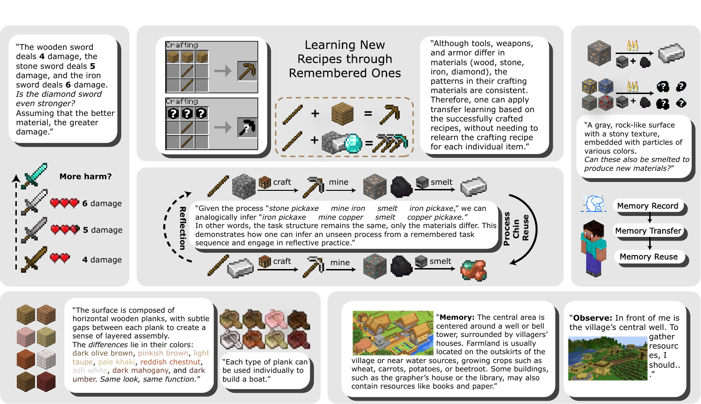
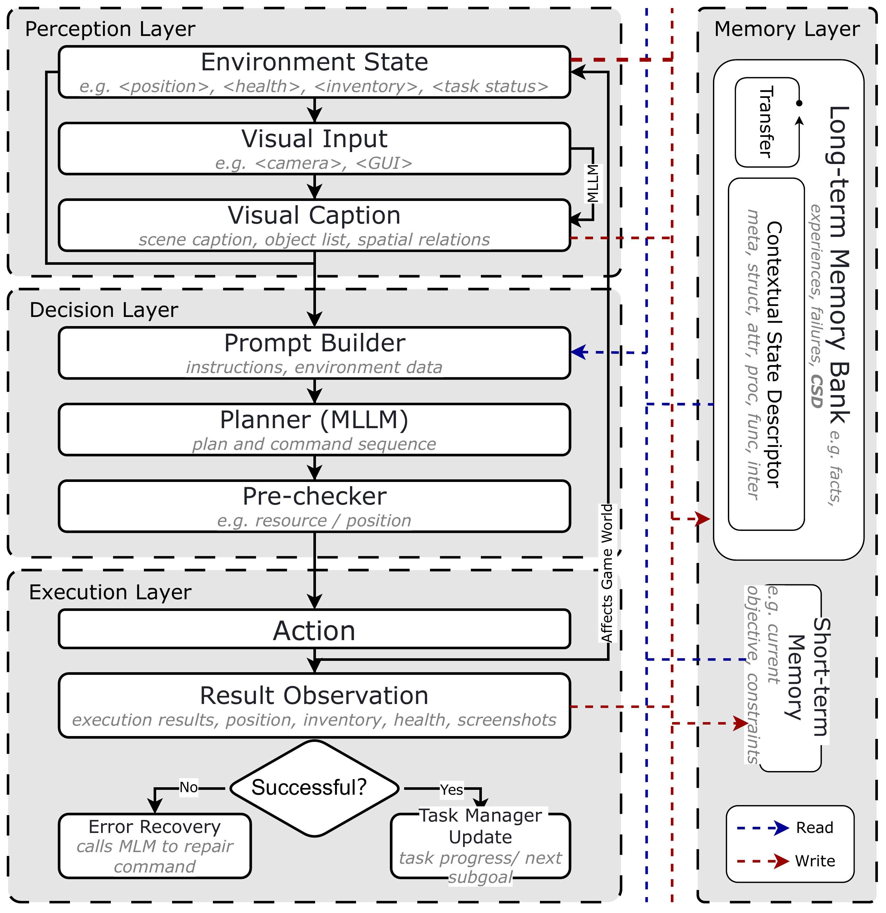
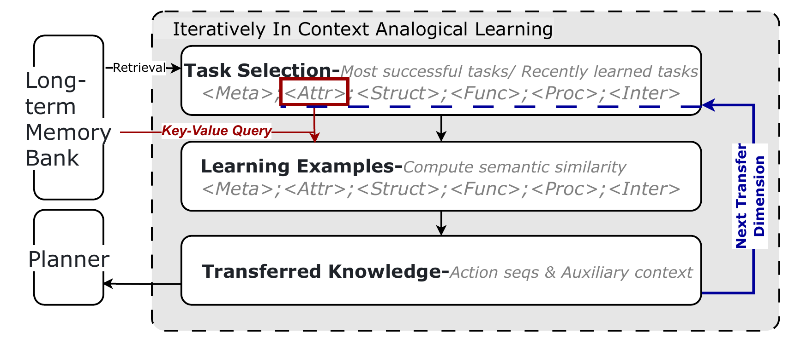

<p align="center">
<h1 align="center">  Echo: Experience Transfer for Multimodal LLM Agents in Minecraft Game</h1>
</p>

<p align="center">
  <a href="https://img.shields.io/badge/version-v0.0.1-blue">
    
  </a>
  <a>
    
  </a>
  <a href="https://openaccess.thecvf.com/content/CVPR2026/html/Li_Experience_Transfer_for_Multimodal_LLM_Agents_in_Minecraft_Game_CVPR_2026_paper.html">
    
  </a>
  <br />
</p>

<p align="center">
  <b>
  | [<a href="https://openaccess.thecvf.com/content/CVPR2026/papers/Li_Experience_Transfer_for_Multimodal_LLM_Agents_in_Minecraft_Game_CVPR_2026_paper.pdf">Paper</a>] | [<a href="https://github.com/CatworldLee/Echo">Project</a>] |
  </b>
  <br />
</p>

🌟 Any contributions via PRs, issues, emails or other methods are greatly appreciated.

<p align="center">
  
</p>

## 🔥 News

- 🎖️ **Echo is accepted by CVPR 2026.**
- 🔥 **We release the research code for experience transfer in Minecraft agents.**
- 🔥 **The paper is available on [CVF OpenAccess](https://openaccess.thecvf.com/content/CVPR2026/papers/Li_Experience_Transfer_for_Multimodal_LLM_Agents_in_Minecraft_Game_CVPR_2026_paper.pdf).**

## 💡 Motivation

Large multimodal agents are increasingly capable of perceiving, planning, and acting in open-ended environments. However, their prior experience is often stored as flat trajectories or short textual memories, making it difficult to identify what can transfer from one task to another. This limits cross-task generalization in Minecraft, where success often depends on reusable relations among materials, layouts, procedures, object functions, and executable interactions.

Motivated by this, we introduce **Echo**, a structured experience-transfer framework for multimodal LLM agents. Echo converts successful task executions into **Contextual State Descriptors (CSDs)** and organizes them along five transfer dimensions: **attribute**, **structure**, **function**, **procedure**, and **interaction**. Given a new task, Echo retrieves related CSD memories and performs **In-Context Analogical Learning (ICAL)** to induce a new plan or task trajectory. We hope Echo can inspire more research on reusable memory, analogy-driven planning, and interpretable transfer for embodied multimodal agents.

## 🧠 Method

Echo follows a memory-then-transfer workflow. Successful experiences are written into a structured memory bank, retrieved through multi-axis similarity, and reused through ICAL planning.

<table>
  <tr>
    <td align="center" width="50%">
      
      <br>
      <strong>Overall iterative framework</strong>
    </td>
    <td align="center" width="50%">
      
      <br>
      <strong>ICAL workflow</strong>
    </td>
  </tr>
</table>

The five transfer dimensions are summarized below:

| Dimension | Description |
| --- | --- |
| **Attribute** | Visual and physical properties of relevant entities. |
| **Structure** | Spatial layout and object relations. |
| **Function** | Object roles, affordances, and utility. |
| **Procedure** | Task dependencies, state transitions, and operation order. |
| **Interaction** | Executed actions, tool-use traces, and agent-environment routines. |

## 🎯 Tasks

Echo includes representative Minecraft task suites for embodied reasoning and experience transfer:

```yaml
Echo
├── crafting       # Resource collection and item synthesis.
├── cooking        # Recipe execution and collaborative preparation.
├── construction   # Blueprint-guided building tasks.
├── collaboration  # Multi-agent coordination tasks.
└── human_ai       # Mixed human-agent task settings.
```

Generated outputs such as ICAL runs, experiment results, temporary files, and runtime bot folders are excluded from the release package by default.

## 🚀 Quick Start

Install the JavaScript and Python dependencies:

```bash
npm install
pip install -r requirements.txt
```

Create a local key file from the template and configure the model backend used by your environment:

```bash
cp keys.example.json keys.json
```

Run a task file:

```bash
python tasks/run_task_file.py --task_path <task_file.json>
```

Run a single task directly:

```bash
node main.js --task_path <task_file.json> --task_id <task_id>
```

Run the ICAL transfer workflow with the included CSD memory example:

```bash
python tasks/run_icl_flow.py --anchor_policy latest_success --top_k 3
```

Each ICAL run creates an output folder containing the retrieved examples, constructed prompt, induced action sequence, and generated task file. The generated task file can then be used for execution or further inspection.

## 🗂️ Repository

The main structure of Echo is as below:

```yaml
Echo_release
├── main.js                 # Main runtime entry.
├── settings.js             # Runtime and method configuration.
├── keys.example.json       # API-key template.
├── csd_data.json           # Example CSD memory bank.
├── src
│   ├── agent/csd           # CSD generation and memory management.
│   ├── agent/tasks         # Task adapters.
│   ├── agent/vision        # Vision helpers.
│   └── models              # Model backend wrappers.
├── tasks                   # Task suites, ICAL scripts, and analysis utilities.
├── profiles                # Model profile templates.
├── patches                 # Dependency compatibility patches.
└── assets                  # README figures and logo.
```

This repository includes the core Echo implementation, representative task suites, and example memory data. Please configure your local environment and model backend before running experiments.

## ✒️ Reference

If you find this project useful for your research, please consider citing the following paper:

```tex
@inproceedings{li2026experience,
  title={Experience transfer for multimodal llm agents in minecraft game},
  author={Li, Chenghao and Liu, Jun and Zhang, Songbo and Jian, Huadong and Ni, Hao and Lee, Lik-Hang and Bae, Sung-Ho and Wang, Guoqing and Yang, Yang and Zhang, Chaoning},
  booktitle={Proceedings of the IEEE/CVF Conference on Computer Vision and Pattern Recognition},
  pages={37143--37153},
  year={2026}
}
```

## 📲 Contact

Please create GitHub issues in the [project repository](https://github.com/CatworldLee/Echo) if you have any questions or suggestions.
